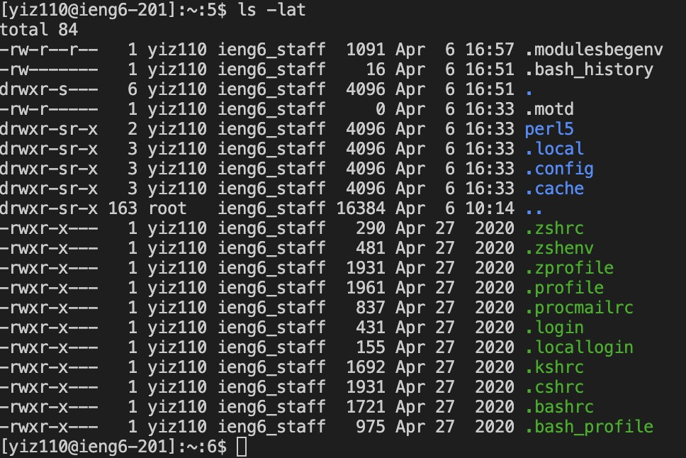

# lab1 report

Here is the screenshot of what I did in the lab.
## * installing VScode
Here I just took a screenshot of the VScode that already installed last quarter.

---
## * Remotely Connecting
Here for the part of remotely connecting, what I did is that I tried to use the command of 
```
# code block
ssh cs15lsp23ng@ieng6.ucsd.edu
```
, but somehow it said 'Permission denied'. So I used the command of 
```
# code block
ssh yiz110@ieng6.ucsd.edu
```
which is my email, then it should that I could connect remotely.


---
## * Trying Some Commands

---
