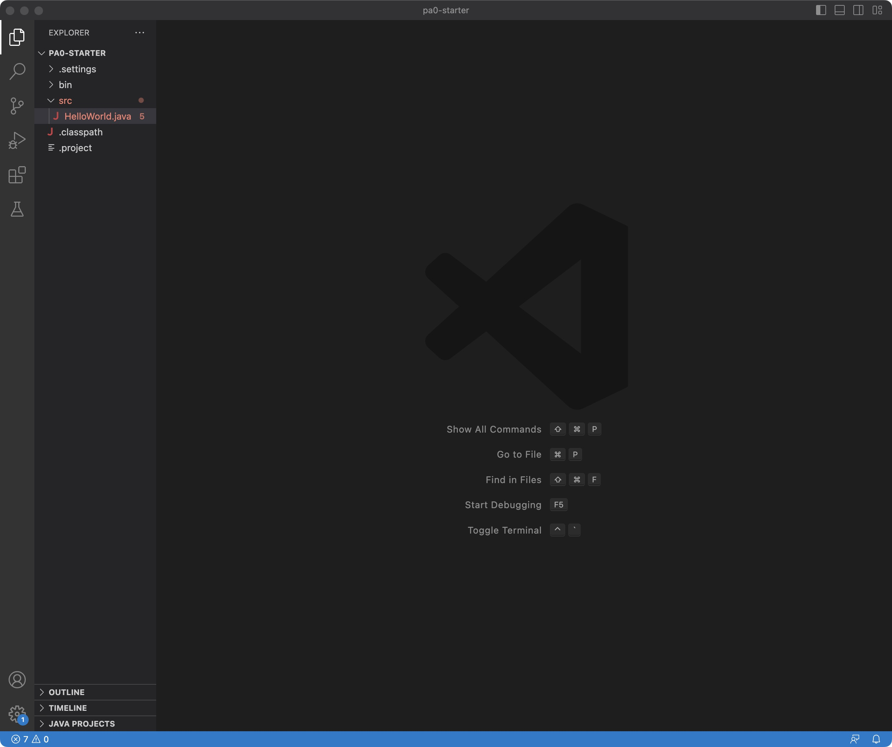

# lab1 report

## installing VScode

* I just took a screenshot of the VScode that already installed last quarter.


---

## Remotely Connecting
* For the part of remotely connecting, what I did is that I tried to use the command of 
```
# input command
ssh cs15lsp23ng@ieng6.ucsd.edu
```
, but somehow it showed 
```
# output command
Permission denied
```
so I used the command of 
```
# input command
ssh yiz110@ieng6.ucsd.edu
```
which is my email, then I could connect remotely by entering my password.

* Then when I connect to remote, it showed me how what server am I in and how many people are in the server.


---

## Trying Some Commands

There are many command that we coould try:
1. cd ~
2. cd 
3. ls -lat
4. ls -a
5. cp /home/linux/ieng6/cs15lsp23/public/hello.txt ~/
6. and so on

* Tried to use the command of cd and cd ~, but nothing appeard, then
* Tried to use the command of ls -lat for the command


* Also I tried to logout from the remote server, and I tried the command of ls -lat, and found out that it will actually show my my file on my laptop instead of the lab server.

---
