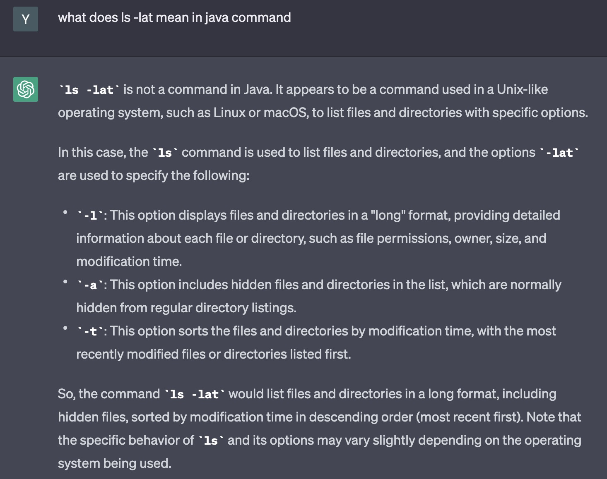

# lab1 report

## installing VScode

* I just took a screenshot of the VScode that already installed last quarter.
* But the installation website [link](https://code.visualstudio.com/download) for it is here.


---

## Remotely Connecting
* For the part of remotely connecting, what I did is that I tried to use the command of 
```
# input command
ssh cs15lsp23ng@ieng6.ucsd.edu
```
in the terminal of vscode to log myself into the remote, but somehow it showed 
```
# output command
Permission denied
```
so I used the command of 
```
# input command
ssh yiz110@ieng6.ucsd.edu
```
which is my email, then I could connect remotely by entering my password.

* Then when I connect to remote, it showed me how what server am I in and how many people are in the server.


---

## Trying Some Commands

There are many command that we coould try:
1. cd ~
2. cd 
3. ls -lat
4. ls -a
5. cp /home/linux/ieng6/cs15lsp23/public/hello.txt ~/
6. and so on

* Tried to use the command of 
```
#input command
cd
```
and
```
#input command
cd~
```
, the command of cd in java is meaing of "change directory", it will allow us to change from current directory to another directory,
* but nothing appeard, then
* Tried to use the command of 
```
#input command
ls -lat 
```
for the command, the command of ls mean that it will list our all the files in the directory for us, and thanks to the sharing from ChatGPT of sharing the meaning of what "ls -lat" command really means, it says that "the command ls -lat would list files and directories in a long format, including hidden files, sorted by modification time in descending order (most recent first)", and here is the screen shot below.



* Also, here is the screenshot of the 


* Also I tried to logout from the remote server by using Ctrl-D, and I tried the command of ls -lat, and found out that it will actually show my my file on my laptop instead of the lab server.

---
