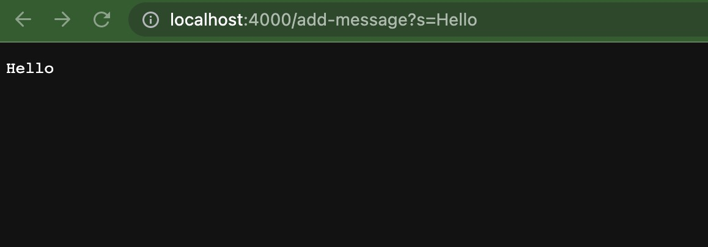
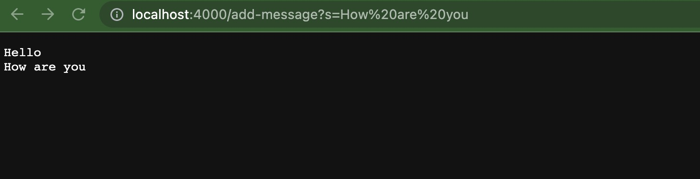

# Part 1
Here is the code I wrote:
```
#code block
import java.io.IOException;
import java.net.URI;

class Handler implements URLHandler {
    // The one bit of state on the server: a number that will be manipulated by
    // various requests.
    String str = "";

    public String handleRequest(URI url) {
        if (url.getPath().equals("/")) {
            return str;
        } 
        else {
            System.out.println("Path: " + url.getPath());
            if (url.getPath().contains("/add-message")) {
                String[] parameters = url.getQuery().split("=");
                if (parameters[0].equals("s")) {
                    str += (parameters[1]) + "\n";
                    return str;
                }
            }
            return "404 Not Found!";
        }
    }
}

class StringServer {
    public static void main(String[] args) throws IOException {
        if(args.length == 0){
            System.out.println("Missing port number! Try any number between 1024 to 49151");
            return;
        }

        int port = Integer.parseInt(args[0]);

        Server.start(port, new Handler());
    }
}
```
And here is the screenshot:

1. the method of handleRequest are being called, and I also compile the java file of StringSearch and Server file, and the output command is that `Server Started! Visit http://localhost:4000 to visit.`
2. and at the beginning, and as we added the value of `/add-message?s=Hello` behind the `4000`, and it will add `Hello` to the server by handleRequest method.
3. when we refresh the page, we will see that it added `Hello` to the website page.


it is the same kind of procedure as the first one, it will just basically add `How are you` to the next line, the reason why it is added to the next line is because of the command `"\n"`.

---
# Part 2
I am choosing the code of ReverseInPlace:

* A failure-inducing input for the buggy program, as a JUnit test and any associated code:
```
# code block
  @Test
  public void testReverseInPlaceLargeArray() {
    int[] input = {1, 2, 3, 4, 5, 6, 7};
    int[] output = {7, 6, 5, 4, 3, 2, 1};
    ArrayExamples.reverseInPlace(input);
    assertArrayEquals(output, input);
 }
```
* An input that doesn’t induce a failure, as a JUnit test and any associated code:
```
# code block
  @Test 
	public void testReverseInPlace() {
    int[] input1 = { 3 };
    ArrayExamples.reverseInPlace(input1);
    assertArrayEquals(new int[]{ 3 }, input1);
	}
```
* The symptom, as the output of running the tests:
1. The first test run into a failure as shown below

2. The second test didn't run into a failure.
* The bug, as the before-and-after code change required to fix it:

1.The before code as shown below:
```
#code block
 static void reverseInPlace(int[] arr) {
    for(int i = 0; i < arr.length; i += 1) {
      arr[i] = arr[arr.length - i - 1];
    }
  }
```
2.The after code as shown below:
```
#code block
 static void reverseInPlace(int[] arr) {
   for (int i = 0; i < arr.length / 2; i++) {
     int temp = arr[i];
     arr[i] = arr[arr.length - i - 1];
     arr[arr.length - i - 1] = temp;
   }
 }
```

3.Explanations:

The original code is facing a problem that it will flip the first half of the array successfully, but it will have a problem with the second last part, it will not successfully reverse it, because it will set the last part just like the first part of the array, for example, it will become {7, 6, 5, 4, 5, 6, 7}.

The changes I did is that I firstly divide the integer array into two parts, it allow me to work with separate two parts. 
So For Example, if I input example array of {1,2,3,4,5,6,7}, arr.length will be 7, and when I divided by 2 in the for loop, it will give me 4, so following the code, ```int temp``` will be 1, and then ```arr[i] = arr[7 - 0 - 1]``` will be stored in the value of ```arr[0] = 7```, and then for the third line in the for loop, we set te last part of the array to be the original first part of the array, which mean that ```arr[7 - 0 - 1] = 1```, then at index 6, the value will be stored as 1, so after the first for loop, we will get a temparary array of {7, null, null, null, null, null, 1}.
So on and so forth, we will eventually flip the array to get the reverse order.

---
# Part 3

I learned something in lab 3, when we are doing the part that the class path when we put in the command line is actually worked separate for mac and window terminals. Also by working with a teammate, he helped me to clearify more things that I am not sure in the past, just like the part for writting junit testing.
