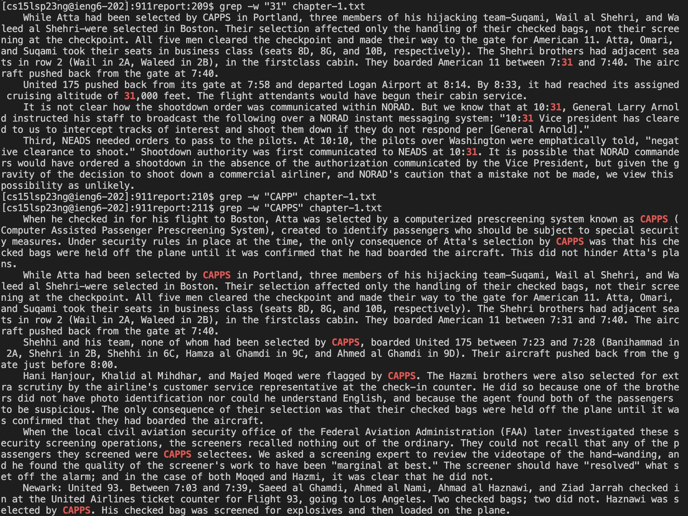

# Researching Commands of grep
---

**Acknowledgement**
All the commands I looked up come from geeksforgeeks.com [link](https://www.geeksforgeeks.org/grep-command-in-unixlinux/)

---

## Setting up
What I did in the terminal is that I login to my ieng6 account by using command `ssh`, and then I git clone the example url, `git clone https://github.com/ucsd-cse15l-s23/stringsearch-data`, and then I use `ls` and `cd` to get myself into the file of 911report. Then I started using different kinds of command option to find what I want with `grep`.

---

## four command line option I chose for grep as shown below
1. `grep -c`, 
* What I did here is that I use `-c` to find certain number of lines that contains the word that I am looking for in `""`, and after that I command it to find it in certain text file and it will privide me with how many lines contain it, as shown below in the jpg.

2. `grep -l`,
* What I did here is that I use `-l` to find the certain word in which file of the current directory in `""`, and the output will provide me with which and how many files that contain this word, as shown below in the jpg. 

3. `grep -n`,
* What I did here is that I use `-n` to find the certain word that is in `""` in the command line of certain text file name after the chosen word, also it will show the line number out, as shown below in the jpg.

4. `grep -w`, 
* What I did here is that I use `-w` to find the certian word that is in `""` in the command line of in certain text file, and it will show all the words that even is part of a whole word. as shown below in the jpg.

