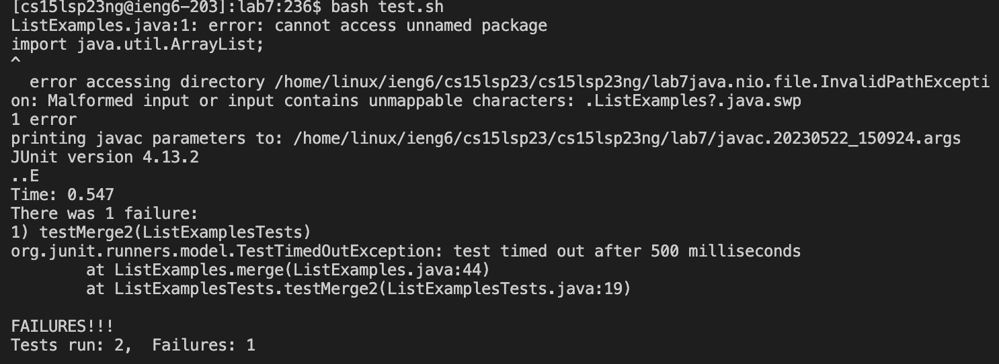

# reproduce the step from 4 - 9

---

4. log into ieng6

* key pressed:
              `ssh<space>cs15lsp23ng@ieng6.ucsd.edu<enter>`
  
  
  ---
  
5. Clone your fork of the repository from your Github account

* key pressed:
               ` `

---

6. Run the tests, demonstrating that they fail

* key pressed:
               ` `

---

7. Edit the code file to fix the failing test

* key pressed:
               ` `

---

8. Run the tests, demonstrating that they now succeed

* key pressed:
               ` `

---

9. Commit and push the resulting change to your Github account

* key pressed:
               ` `

---
