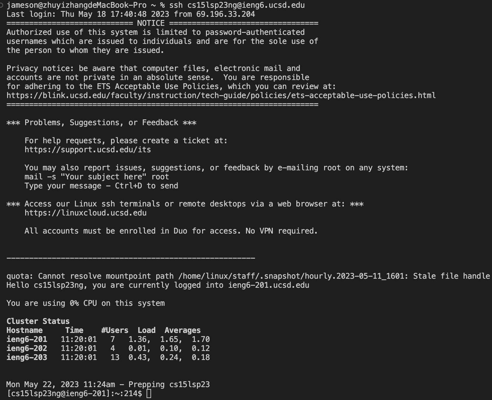
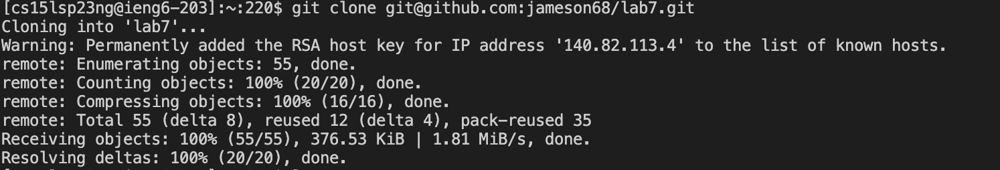
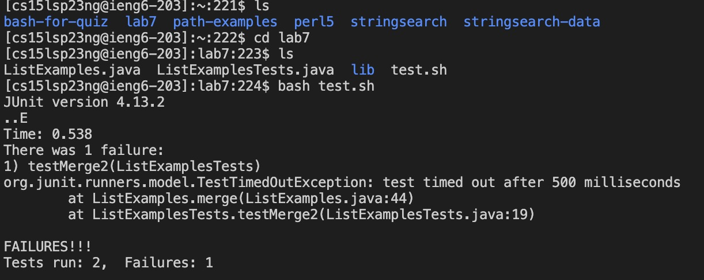
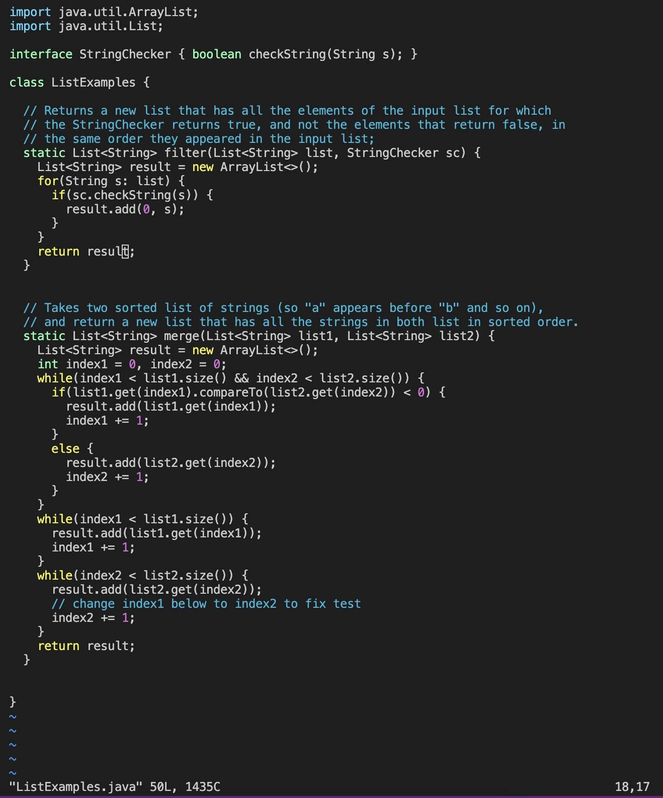
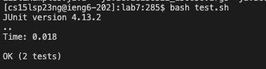
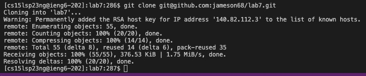

# reproduce the step from 4 - 9

---

4. log into ieng6

* key pressed:
              `ssh<space>cs15lsp23ng@ieng6.ucsd.edu<enter>`
  
  
  ---
  
5. Clone your fork of the repository from your Github account

* key pressed:
               `git<space>clone<space><control v(I copied before of the path)><enter>`

---

6. Run the tests, demonstrating that they fail

* key pressed:
               `ls<enter>cd<space>lab7<enter>ls<enter>bash<space>test.sh<enter> `

---

7. Edit the code file to fix the failing test

* key pressed:
               `j(multiple times)right button(mutiple times until reached 1)i<delete>2<esc>:wq<enter> `

---

8. Run the tests, demonstrating that they now succeed

* key pressed:
               `bash<space>test.sh<enter> `

---

9. Commit and push the resulting change to your Github account

* key pressed:
               `git<space>clone<space>git<shift>2github.com<shift>;jameson68/lab7.git<enter>`

---
