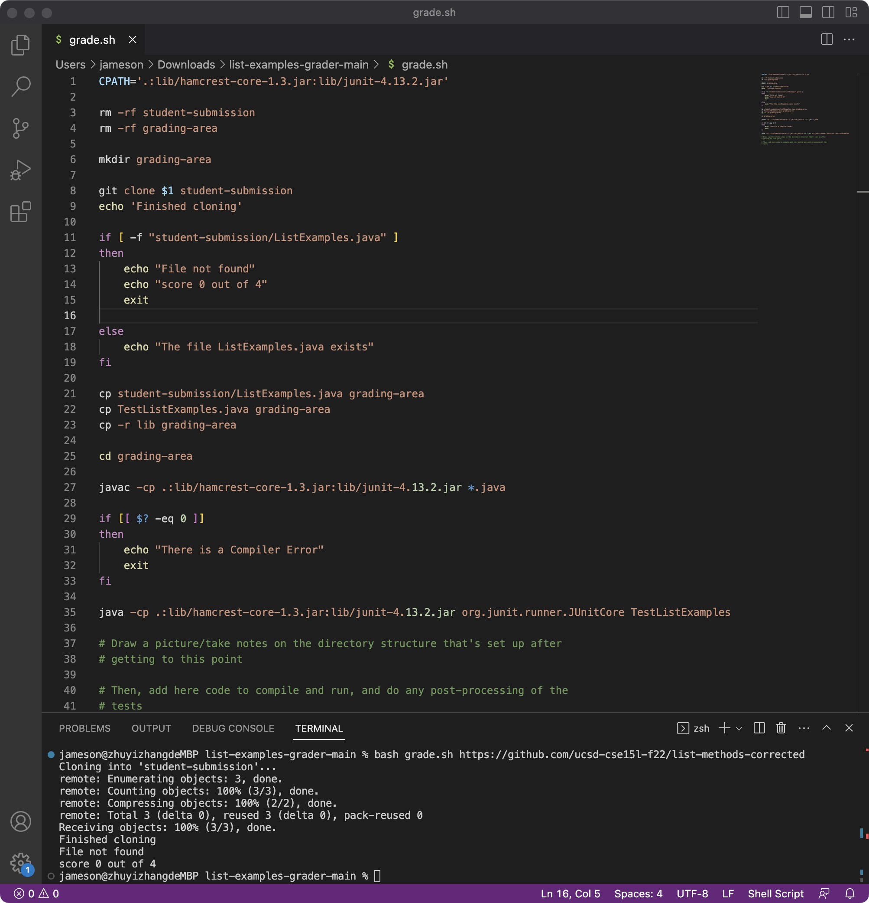

# part 1: Debugging Scenario

---

1. Creating a new question:
* New Question
* Title: Debugging Issue
* Category: Debugging
* Paragraph:

---

a. What enviroment are you using(computer, operating system, web brower, terminal/editor, and so on)?

Mac, vscode, and using terminal.

b. Detail the symptom you're seeing. Be specific; include both what you're seeing and what you expected to see instead. Screenshots are great, copy-pasted terminal output is also great. Avoid saying “it doesn't work”.

I am trying to run the bash, and it suppose to have the result that file exist, but it said file not found.

it said 
`Receiving objects: 100% (3/3), done.
Finished cloning
File not found
score 0 out of 4
`

c. Detail the failure-inducing input and context. That might mean any or all of the command you're running, a test case, command-line arguments, working directory, even the last few commands you ran. Do your best to provide as much context as you can.

