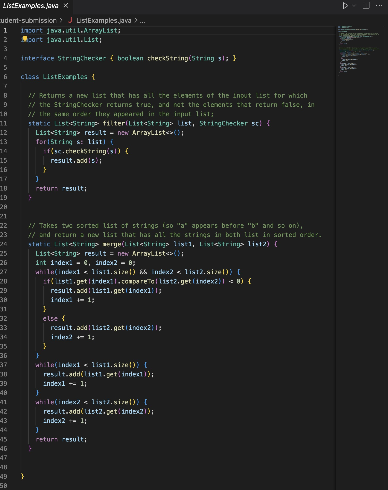

# part 1: Debugging Scenario

---

1. Creating a new question:
* New Question
* Title: Debugging Issue
* Category: Debugging
* Paragraph:

a. What enviroment are you using(computer, operating system, web brower, terminal/editor, and so on)?

Mac, vscode, and using terminal.

b. Detail the symptom you're seeing. Be specific; include both what you're seeing and what you expected to see instead. Screenshots are great, copy-pasted terminal output is also great. Avoid saying “it doesn't work”.

I am trying to run the bash, and it suppose to have the result that file exist, but it said file not found.

c. Detail the failure-inducing input and context. That might mean any or all of the command you're running, a test case, command-line arguments, working directory, even the last few commands you ran. Do your best to provide as much context as you can.

---

1. A response from TA

I couldn't see all of your code in the grade.sh, I think it's something wrong in the shell code that you wrote, could you please show me all of the code that in grade.sh?

---

2. Another screenshot from student

student response:
Hi! sorry I didn't screenshot all of it. Here is all of my code.

and here it is successfully compiled, but this has a error saying that file not found, which is not true here, but I don't know how to fix it.

---

3. All the information

* file&directory structure

* contents of each file before fixing bug

* full command line you ran to trigger the bug

* description of what to do to fix it

First of all, I think the problem is coming out from your code from grade.sh, on line from line 13-18, which is in the then and else statement, you should switch them in order to make it work as we found it and print out it exists instead of print our file not found, you just didn't flip it. So it should be `then echo "......exits" else "not found....`, overall just simply switch the code in `then` and `else` will do.

---

# part 2 - Reflection

before the second half of the quarter, I don't even know what a shell is and I don't know how to use vim and etc method to do it. Also I learned how to write a gradescope testing which is really cool. I think these command will actually help me to save time a lot in the future coding.

